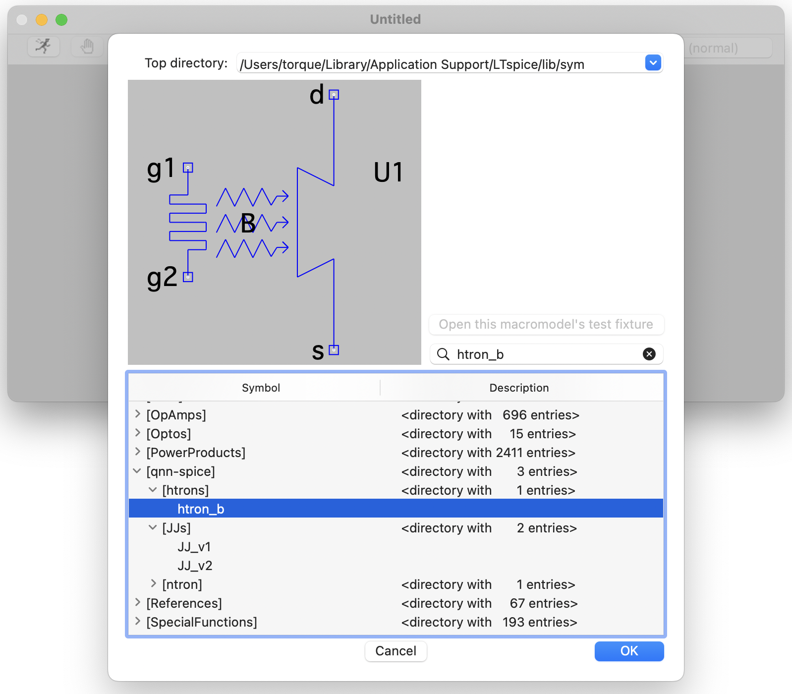

# qnn-spice
QNN's SPICE models library

This repository sync's all of the SPICE models we use with their respective remotes
and updates the LTSpice internal directory to add a new `[qnn-spice]` folder into
LTSpice's component library that sorts the components.

## Example

<center></center>

The component library for the following `models.md` config:

```
- htron_behavioral: htrons
  - htron_behav_model.asc: htron_b.asc
  - htron_behav_model.asy: htron_b.asy
- JJ: JJs
  - JJ.asy: JJ_v1.asy
  - JJ.lib: JJ_v1.lib
- JJ_v2: JJs
  - JJ.asy: JJ_v2.asy
  - JJ.lib: JJ_v2.lib
- ntron: ntron
  - ntron.lib
  - ntron.asy
```


## Usage

If you are using this repo for the first time, [go to Installation](#Installation). 

#### How to sync repos and download the latest models?

Run `./update` in the root of the qnn-spice repo. This will pull
all the latest changes from all available repos and sync the
files in `models.md` to your local LTSpice directory, so you can
access all the models as in the Example.

#### How to push changes to a model?

Just like how you would push to a regular github repo,
go into the repo with your edited file, for example,
snspd-spice and, as you would normally do, run 
``` bash
$ pwd # should return .../snspd-spice
$ git add .
$ git commit -m "Updating model"
$ git push
```

#### How to add a new repo?

put git submodule explanation

## Installation

### install notes

- `chmod +x update`
- git submodule update
- check update script on windows, might need a separate file...